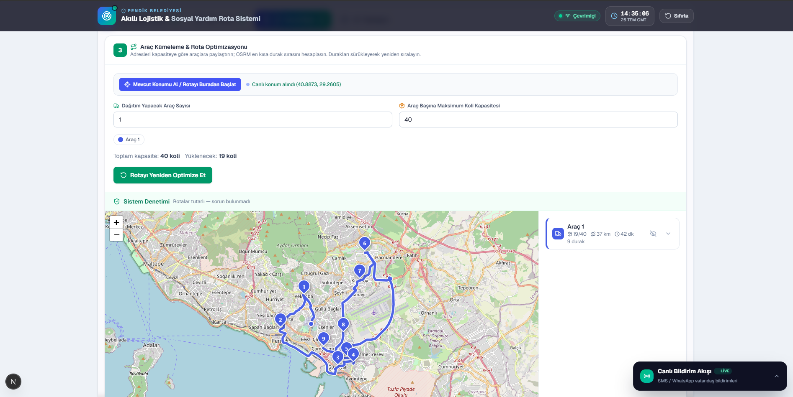
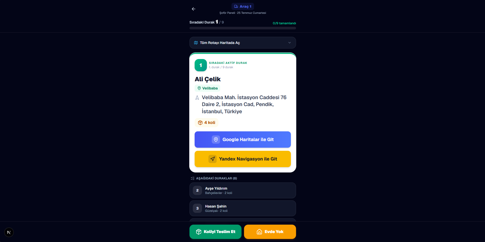

<div align="center">

# 🚚 Pendik Belediyesi | Akıllı Lojistik ve Sosyal Yardım Rota Optimizasyon Sistemi

**Kirli Excel/PDF verisinden → optimize edilmiş, sahada canlı takip edilebilir dağıtım rotalarına.**

Gezgin Satıcı (TSP) ve Araç Rotalama (VRP) algoritmalarıyla sosyal yardım kolilerinin en kısa mesafe, en az yakıt ve en düşük karbon salınımıyla dağıtılmasını sağlayan uçtan uca bir akıllı şehir lojistik platformu.


<br />

[](https://social-aid-routing-system-wpuj.vercel.app)

**🔗 Canlı Demo:** [social-aid-routing-system-wpuj.vercel.app](https://social-aid-routing-system-wpuj.vercel.app)

</div>

---

## 🎯 Projenin Amacı ve Çözülen Problem

Belediyelerin sosyal yardım dağıtımı klasik olarak **hantal ve hataya açık** bir süreçtir:

- 📋 **Kirli veri:** Yardım listeleri elle doldurulmuş, tutarsız ve hatalı yazılmış Excel/PDF adreslerinden oluşur ("Pendik/Çınardere Mh 5. sk no12 daire3" gibi).
- ⛽ **Yakıt ve zaman israfı:** Şoförler adresleri sezgisel/rastgele sırayla gezer; aynı mahalleye günde birkaç kez gidilir.
- 🧮 **Manuel planlama:** Hangi aracın nereye gideceği kâğıt üzerinde, optimizasyonsuz planlanır.
- ❓ **Takip yokluğu:** "Şoför nerede, koli teslim edildi mi, evde yok muydu?" sorusunun anlık bir yanıtı olmaz.

Bu sistem tüm bu adımları tek bir akışta **otomatikleştirir ve optimize eder:**

> Kirli Excel/PDF yüklenir (ya da adres elle girilir) → adresler akıllıca temizlenir (sanitize) → **Google/Yandex/OSM zinciriyle** koordinata çevrilir (geocoding) → araç kapasitelerine göre **K-Means ile coğrafi kümelere** ayrılır → her küme **OSRM Trip API (TSP)** ile en kısa rotaya optimize edilir → şoför mobil arayüzden adım adım (Google/Yandex/Apple) navigasyonla dağıtımı yapar → yönetici, şoförü ve teslimatları **haritada canlı** izler → gün sonu raporu Excel olarak dışa aktarılır.

Sonuç: **daha az yakıt, daha az CO₂, daha az zaman ve tam izlenebilirlik.**

---

## ✨ Öne Çıkan Özellikler (Key Features)

- 🧹 **Akıllı Adres Sanitize & Hatalı Veri Kurtarma** — Tutarsız/kirli adresleri normalize eder; Türkçe karakter düzeltme ve Levenshtein tabanlı bulanık (fuzzy) mahalle eşleştirmesiyle "dirty data" satırlarını kurtarır.
- 📥 **Çok Kaynaklı Adres Girişi (Excel · PDF · Elle)** — `.xlsx/.xls` yükleme, **metin tabanlı PDF listelerinden adres çıkarma** (sütun tespitiyle "Ad Soyad | Adres" ayrımı) ve telefonla gelen tek başvurular için **elle tek adres ekleme** formu.
- 🌍 **Çok Sağlayıcılı Geocoding (Google → Yandex → OSM)** — Adresler önce Google, bulunamazsa Yandex, o da olmazsa OpenStreetMap ile konumlanır. Anahtarlar **sunucu tarafında** tutulur, tarayıcıya sızmaz; hiçbir anahtar yoksa sistem yalnızca OSM ile çalışmaya devam eder. Ayrıca her adres için tek tıkla **Google Maps'te doğrulama** yardımcısı.
- 🗺️ **K-Means Kümeleme + OSRM Rota Optimizasyonu** — Adresleri araç kapasitesine göre coğrafi kümelere ayırır, her araç için TSP (Gezgin Satıcı) çözümü üretir; araç başına ayrı renkli, numaralandırılmış rota çizgisi.
- 📱 **Kurye / Şoför Saha Arayüzü** — Kurye standartlarında, aydınlık ve ergonomik mobil UI; "Sıradaki Durak X/Y" ilerleme takibi ve **Google · Yandex · Apple Haritalar** navigasyon derin bağlantıları.
- 📡 **Canlı Rota Paylaşımı + Canlı Şoför Takibi** — Yönetici "Canlı Paylaşım" başlatır; QR/link herhangi bir telefonda açılır. Şoförün işaretlediği teslimatlar **ve konumu**, yönetici panelindeki **canlı takip haritasında** anlık görünür (kısa aralıklı yoklama ile).
- ✅ **Basit ve Hızlı Teslim Onayı** — Her durakta tek dokunuşla, yanlışlıkla basmayı önleyen küçük bir onay penceresiyle "Teslim Edildi / Evde Yok" işaretleme.
- 🔄 **Sürükle-Bırak Rota Müdahalesi & Gün Sonu Excel Export** — Yönetici durak sırasını sürükle-bırakla değiştirir; km/dk canlı yeniden hesaplanır. Gün sonunda "Dağıtım Durumu" ve "Atanan Araç/Sıra" sütunlarıyla Excel çıktısı. Elle düzeltilen koordinatlar dışa aktarımda saklanır ve tekrar yüklemede korunur (round-trip).
- 📴 **PWA & Çevrimdışı (Offline) Çalışma Desteği** — Manifest + Service Worker ile sahada bağlantı koptuğunda dahi çalışabilen, kurulabilir uygulama.
- ♿ **Erişilebilir & Sade Tasarım** — Okunabilirlik için tasarlanmış **Lexend** yazı tipi, klavye odak halkaları (`:focus-visible`), `prefers-reduced-motion` desteği ve WCAG-uyumlu renk kontrastları.
- 🛡️ **Kurumsal Güvenlik & Hata Toleransı** — Katı dosya doğrulaması (uzantı/MIME/boyut), XSS & Excel formül-enjeksiyonu temizliği, React/Next.js hata sınırları (beyaz ekran koruması) ve bozulmaya dayanıklı güvenli localStorage.

---

## 📸 Ekran Görüntüleri (Screenshots)

| Yönetici Komuta Merkezi | Mobil Şoför Arayüzü |
| :---: | :---: |
| [](docs/dashboard.png) | [](docs/mobile.png) |
| *Yönetici paneli — özet sayılar, harita, rota konsolu, canlı takip* | *Kurye standardında saha arayüzü — navigasyon & canlı konum* |

> 📌 Görselleri `docs/` klasörüne `dashboard.png` ve `mobile.png` olarak ekleyin; bağlantılar otomatik çalışır.

---

## 🏗️ Mimari ve Kullanılan Teknolojiler (Tech Stack)

| Katman | Teknoloji | Rolü |
| --- | --- | --- |
| **Frontend / Framework** | Next.js 16 (App Router, Turbopack), React 19 | SSR-güvenli sayfa/route yapısı, sunucu proxy'leri |
| **Dil** | TypeScript 5 | Uçtan uca tip güvenliği |
| **Stil / UI** | Tailwind CSS 4, lucide-react, Lexend | Aydınlık, ferah ve erişilebilir kurumsal SaaS estetiği |
| **Harita** | Leaflet + react-leaflet 5 | Etkileşimli harita, özel `divIcon` marker'lar, polyline'lar, canlı şoför pini |
| **Rota Motoru (Routing)** | OSRM (Trip API = TSP, Route API = sıra koruma) | Rota optimizasyonu & geometri/mesafe/süre |
| **Geocoding** | Google → Yandex → Nominatim (sunucu proxy, cascade) | Adres → koordinat; sağlayıcı zinciri + mahalle-merkezi fallback |
| **PDF Okuma** | pdfjs-dist (sunucu tarafı metin çıkarımı) | PDF listelerinden adres/sütun ayrıştırma |
| **Kümeleme (Clustering)** | Kapasite kısıtlı K-Means++ (Haversine) | Adresleri araçlara coğrafi olarak dağıtma |
| **State Management** | Zustand 5 + persist (güvenli storage) | Global akış durumu, kalıcılık ve göç (migration) |
| **Canlı Paylaşım Deposu** | Upstash Redis (REST) · in-memory yedek | Paylaşım + canlı şoför konumu (24s TTL) |
| **Sürükle-Bırak** | @hello-pangea/dnd | Rota durak sırası düzenleme |
| **Excel G/Ç** | SheetJS (xlsx) | Güvenli içe/dışa aktarma, formül-enjeksiyonu koruması |
| **PWA / Offline** | Web App Manifest + Service Worker | Kurulabilirlik & çevrimdışı çalışma |

**Mimari akış:**

```
Excel / PDF / Elle Giriş ─▶ Sanitize (fuzzy/Türkçe) ─▶ Geocode (Google→Yandex→OSM)
     │                                                          │
     ▼                                                          ▼
K-Means Kümeleme (kapasite) ─▶ OSRM TSP Optimizasyon ─▶ Harita + Rota Konsolu
                                                          │
                                       ┌──────────────────┴───────────────────┐
                                       ▼                                       ▼
                     Şoför Mobil Arayüzü + Canlı Konum          Yönetici Canlı Takip + Excel Rapor
                  (Google/Yandex/Apple navigasyon · offline)     (harita · durum · araç/sıra sütunları)
```

> ⚙️ Tarayıcının Nominatim/OSRM'e doğrudan `User-Agent` gönderememesi, CORS kısıtları ve **API anahtarlarının gizliliği**, Next.js **API route proxy'leriyle** (`/api/geocode`, `/api/route-optimize`, `/api/pdf-addresses`, `/api/share`) aşılmıştır.

---

## 📡 Canlı Şoför Paylaşımı & Takibi (Live Sync + Tracking)

Rotalar tarayıcıda (Zustand + `localStorage`) tutulduğu için, ham şoför linki yalnızca aynı cihazda çalışır. **Canlı Paylaşım** bu sınırı, hafif bir sunucu paylaşım katmanıyla kaldırır:

```
Yönetici ──"Canlı Paylaşım Başlat"──▶ POST /api/share ──▶ paylaşım deposu ──▶ shareId
   ▲                                                                            │
   │  ~4 sn'de bir yoklama (canlı durum + şoför konumu)      QR / link: /driver/<araç>?sid=<shareId>
   │                                                                            │
   └──────── GET /api/share/<id> ◀── PATCH (teslim ettim · evde yok · konumum) ─┘ ◀── Şoför (telefon)
```

- **Yayınla:** Yönetici panelindeki 4. adımda "Canlı Paylaşımı Başlat" → mevcut rotalar sunucuya yazılır, kısa bir `shareId` üretilir.
- **Aç:** QR/link `?sid=<shareId>` taşır; şoför herhangi bir telefonda açar, rota sunucudan yüklenir.
- **Canlı durum:** Şoför bir teslimatı işaretlediğinde `PATCH` ile sunucuya yazılır; yönetici paneli kısa aralıklı yoklamayla durumu **canlı** gösterir.
- **Canlı konum:** Şoför "Canlı Konumu Paylaş"ı açtığında GPS konumu düzenli aralıklarla sunucuya gönderilir ve yöneticinin **canlı takip haritasında** atım animasyonlu pinle görünür. Durak ve konum güncellemeleri birbirini ezmez.

### Depolama modları

| Mod | Koşul | Davranış |
| --- | --- | --- |
| **Kalıcı (önerilen)** | `UPSTASH_REDIS_REST_URL` + `UPSTASH_REDIS_REST_TOKEN` tanımlı | Upstash Redis REST üzerinden; Vercel gibi çok-örnekli ortamda güvenilir çalışır. Paylaşımlar 24 saat sonra otomatik silinir. |
| **Geçici (yedek)** | Env tanımlı değil | Sunucu belleğinde (in-memory). Tek süreçli `npm run dev` ile telefon testi için yeterlidir; sunucu yeniden başlarsa kaybolur. |

---

## 🚀 Kurulum ve Çalıştırma (Getting Started)

### Ön Gereksinimler

- **Node.js 20 LTS+** (Node 22 önerilir — PDF motoru için) ve **npm**

### Adımlar

```bash
# 1) Depoyu klonlayın
git clone https://github.com/mustafanazli/social-aid-routing-system.git
cd social-aid-routing-system

# 2) Bağımlılıkları yükleyin
npm install

# 3) Ortam değişkenlerini hazırlayın (opsiyonel — tanımlanmazsa public/OSM servisler kullanılır)
cp .env.example .env.local
#   Windows PowerShell için: Copy-Item .env.example .env.local

# 4) Geliştirme sunucusunu başlatın
npm run dev
```

Ardından tarayıcıdan **[http://localhost:3000](http://localhost:3000)** adresini açın.

### 🖱️ Windows'ta Tek Tıkla Çalıştırma

Terminalle uğraşmak istemeyenler için proje kökünde bir **`start-app.cmd`** başlatıcısı vardır. Çift tıklandığında gerekiyorsa bağımlılıkları kurar, geliştirme sunucusunu başlatır ve tarayıcıda `localhost:3000`'i açar.

### 🔐 Ortam Değişkenleri (Environment Variables)

Tümü **opsiyoneldir**; tanımlanmazsa genel (public) demo servisleri kullanılır. Ayrıntılar için [`.env.example`](.env.example) dosyasına bakın.

| Değişken | Açıklama | Varsayılan |
| --- | --- | --- |
| `NEXT_PUBLIC_OSRM_URL` | OSRM rota optimizasyon sunucusu | `https://router.project-osrm.org` |
| `NEXT_PUBLIC_NOMINATIM_URL` | Nominatim geocoding uç noktası (son çare) | `https://nominatim.openstreetmap.org/search` |
| `NEXT_PUBLIC_NOMINATIM_RATE_LIMIT_MS` | Geocoding istekleri arası min. gecikme (ms) | `1000` |
| `GOOGLE_MAPS_API_KEY` | Google Geocoding API anahtarı — **sunucu tarafı** otomatik konumlama (1. sağlayıcı) | _(boş → atlanır)_ |
| `YANDEX_GEOCODER_API_KEY` | Yandex Geocoder HTTP API anahtarı — **sunucu tarafı** (2. sağlayıcı) | _(boş → atlanır)_ |
| `UPSTASH_REDIS_REST_URL` | Canlı paylaşım için Upstash Redis REST adresi (sunucu tarafı) | _(boş → in-memory)_ |
| `UPSTASH_REDIS_REST_TOKEN` | Upstash Redis REST erişim jetonu (sunucu tarafı, gizli) | _(boş → in-memory)_ |

> ⚠️ **Güvenlik notu:** `NEXT_PUBLIC_` ön ekli değişkenler tarayıcıya gömülür — buraya **asla gizli anahtar koymayın**. `GOOGLE_MAPS_API_KEY`, `YANDEX_GEOCODER_API_KEY` ve `UPSTASH_*` değişkenleri **ön eksizdir**; yalnızca sunucuda okunur ve tarayıcıya sızmaz. Geocoding anahtarlarından hiçbiri tanımlı değilse sistem yalnızca OpenStreetMap ile çalışır.

### ▲ Vercel'e Deploy

1. Bu depoyu [vercel.com](https://vercel.com) → **New Project** ile içe aktarın (Next.js otomatik algılanır; ek yapılandırma gerekmez).
2. **Project Settings → Environment Variables** altına yukarıdaki gizli değişkenleri ekleyin (`GOOGLE_MAPS_API_KEY`, `YANDEX_GEOCODER_API_KEY`, `UPSTASH_REDIS_REST_URL`, `UPSTASH_REDIS_REST_TOKEN`).
3. **Deploy** — sunucu fonksiyonları [`vercel.json`](vercel.json) ile Türkiye'ye en yakın **Frankfurt (fra1)** bölgesinde çalışır.

> API anahtarları alma: **Google** — [console.cloud.google.com](https://console.cloud.google.com) → "Geocoding API" etkinleştir → anahtar (faturalandırma açık, aylık 200$ ücretsiz kredi). **Yandex** — [developer.tech.yandex.ru](https://developer.tech.yandex.ru) → "Geocoder HTTP API" ücretsiz anahtar. **Upstash** — [upstash.com](https://upstash.com) → Redis DB → "REST API" sekmesi.

### Kullanılabilir Komutlar

```bash
npm run dev      # Geliştirme sunucusu (Turbopack)
npm run build    # Üretim derlemesi
npm run start    # Üretim sunucusu (build sonrası)
npm run lint     # ESLint denetimi
```

---

## 📂 Proje Yapısı (Özet)

```
src/
├── app/                 # App Router: sayfalar, API proxy'leri, hata sınırları
│   ├── api/geocode/         # Çok sağlayıcılı geocoding (Google→Yandex→OSM)
│   ├── api/route-optimize/  # OSRM proxy (TSP + sıra koruma)
│   ├── api/pdf-addresses/   # PDF'ten adres çıkarma (pdfjs)
│   ├── api/share/           # Canlı paylaşım + şoför konumu (yayınla / oku / güncelle)
│   └── driver/[routeId]/    # Şoför mobil ekranı
├── components/          # UI (map, route, driver, excel, common)
├── lib/                # Algoritmalar: clustering, security, validator, pdfImport...
├── services/           # nominatimService, osrmService, shareService
├── store/              # Zustand global state (güvenli persist)
├── hooks/              # useCountUp, useCurrentLocation, useOnlineStatus...
└── constants/          # config, mahalle verisi
```

---

## 📜 Lisans

Bu proje [MIT Lisansı](LICENSE) ile lisanslanmıştır — © 2026 Mustafa Nazlı.

---

<div align="center">

**Bir staj & portföy projesi olarak; akıllı şehir, kamu teknolojisi (GovTech) ve lojistik optimizasyonu alanlarına yönelik geliştirilmiştir.**

</div>
